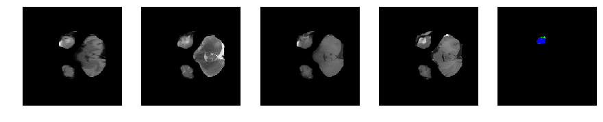

# Brats Introduction


```python
import os
import subprocess
import numpy as np
import nibabel as nib
import scipy.misc as m
import matplotlib.pyplot as plt
from mpl_toolkits import mplot3d
```

----
# About the Data
----

The dataset contains MRI scans of glioblastoma (GBM/HGG) and lower grade glioma (LGG)

### The multimodal scans are:

1. Native (T1) 
2. Post-contrast T1-weighted (T1Gd)
3. T2-weighted (T2)
4. T2 Fluid Attenuated Inversion Recovery (FLAIR)

### All the imaging datasets have been segmented manually, by one to four raters

1. The GD-enhancing tumor (ET — label 4)
2. The peritumoral edema (ED — label 2)
3. The necrotic and non-enhancing tumor (NCR/NET — label 1)
4. Everything else (label 0)

** *The provided data are distributed after their pre-processing, i.e. co-registered to the same anatomical template, interpolated to the same resolution (1 mm^3) and skull-stripped.* **

-----
# Task 1 : Segmentation of gliomas in pre-operative scans
-----
* To develop their method and produce segmentation labels of the different glioma sub-regions. 
* The sub-regions considered for evaluation are
    * The "enhancing tumor" (ET)
    * The "tumor core" (TC)
    * The "whole tumor" (WT)
    
The ET is described by areas that show hyper-intensity in T1Gd when compared to T1, but also when compared to “healthy” white matter in T1Gd. 

The TC describes the bulk of the tumor, which is what is typically resected. The TC entails the ET, as well as the necrotic (fluid-filled) and the non-enhancing (solid) parts of the tumor. The appearance of the necrotic (NCR) and the non-enhancing (NET) tumor core is typically hypo-intense in T1-Gd when compared to T1. 

The WT describes the complete extent of the disease, as it entails the TC and the peritumoral edema (ED), which is typically depicted by hyper-intense signal in FLAIR.


--------
# Task 2 : Prediction of patient overall survival from pre-operative scans
--------
Once the participants produce their segmentation labels in the pre-operative scans, they will be called to use these labels in combination with the provided multimodal MRI data to extract imaging/radiomic features that they consider appropriate, and analyze them through machine learning algorithms, in an attempt to predict patient OS.

The participants do not need to be limited to volumetric parameters, but can also consider intensity, morphologic, histogram-based, and textural features, as well as spatial information, and glioma diffusion properties extracted from glioma growth models.


```python
data_path = '/home/khushhall/Downloads/newFile/Brats17TrainingData/'
subType = 'HGG/'

modalities = ['flair', 't2', 't1', 't1ce']
segmap_id = 'seg'
class_idx = [0, 1, 2, 4]
num_slices = 155
scan_shape = [240, 240, 150]
colormap = {0: [0, 0, 0],
            1: [255, 0, 0],
            2: [0, 255, 0],
            4: [0, 0, 255]}
```


```python
def get_patient_data(fileName):
    volumes = []
    for i in modalities:
        volumes.append(nib.load(data_path+subType+fileName+'/'+fileName+'_'+i+'.nii').get_data())
    segmap = nib.load(data_path+subType+fileName+'/'+fileName+'_'+segmap_id+'.nii').get_data()
    
    return np.asarray(volumes), np.asarray(segmap)

def visualize_segmap(temp):
    r = temp.copy()
    g = temp.copy()
    b = temp.copy()

    for l in class_idx:
        color = colormap[l]
        r[temp==l] = color[0]
        g[temp==l] = color[1]
        b[temp==l] = color[2]

    rgb = np.zeros((temp.shape[0], temp.shape[1], 3))
    rgb[:,:,0] = r
    rgb[:,:,1] = g
    rgb[:,:,2] = b
    return np.asarray(rgb, dtype=np.uint8)
```


```python
import numpy as np
import matplotlib.pyplot as plt
%matplotlib inline

fileName = 'Brats17_2013_10_1'
x, y = get_patient_data(fileName)

for j in range(28, num_slices-50):  
    print 'Slice number = ', j
    fig = plt.figure(figsize=(15,15))
    idx = j
    for i in range(5):
        ax = fig.add_subplot(1,5,i+1)
        ax.axis('off')
        if i == 4:
            segmap_ = visualize_segmap(y[:,:,idx])
            ax.imshow(segmap_[:,:,:])
        else:
            ax.imshow(x[i][:,:,idx], cmap='gray')
          
    plt.show()  
```

    Slice number =  28


    Slice number =  29


    Slice number =  30


    Slice number =  31


    Slice number =  32


    Slice number =  33


    Slice number =  34





    Slice number =  35


    Slice number =  36


    Slice number =  37


    Slice number =  38


    Slice number =  39


    Slice number =  40


    Slice number =  41


    Slice number =  42


    Slice number =  43


    Slice number =  44


    Slice number =  45


    Slice number =  46


    Slice number =  47


    Slice number =  48


    Slice number =  49


    Slice number =  50


    Slice number =  51


    Slice number =  52


    Slice number =  53


    Slice number =  54


    Slice number =  55


    Slice number =  56


    Slice number =  57


    Slice number =  58


    Slice number =  59


    Slice number =  60


    Slice number =  61


    Slice number =  62


    Slice number =  63


    Slice number =  64


    Slice number =  65


    Slice number =  66


    Slice number =  67


    Slice number =  68


    Slice number =  69


    Slice number =  70


    Slice number =  71


    Slice number =  72


    Slice number =  73


    Slice number =  74


    Slice number =  75


    Slice number =  76


    Slice number =  77


    Slice number =  78


    Slice number =  79


    Slice number =  80


    Slice number =  81


    Slice number =  82


    Slice number =  83


    Slice number =  84


    Slice number =  85


    Slice number =  86


    Slice number =  87


    Slice number =  88


    Slice number =  89


    Slice number =  90


    Slice number =  91


    Slice number =  92


    Slice number =  93


    Slice number =  94


    Slice number =  95


    Slice number =  96


    Slice number =  97


    Slice number =  98


    Slice number =  99


    Slice number =  100


    Slice number =  101


    Slice number =  102


    Slice number =  103


    Slice number =  104


```python
import numpy as np
import matplotlib.pyplot as plt
%matplotlib inline

fileName = 'Brats17_CBICA_ATX_1'
x, y = get_patient_data(fileName)

for j in range(41, num_slices-65):  
    print 'Slice number = ', j
    fig = plt.figure(figsize=(15,15))
    idx = j
    for i in range(5):
        ax = fig.add_subplot(1,5,i+1)
        ax.axis('off')
        if i == 4:
            segmap_ = visualize_segmap(y[:,:,idx])
            ax.imshow(segmap_[:,:,:])
        else:
            ax.imshow(x[i][:,:,idx], cmap='gray')
          
    plt.show()  
```

    Slice number =  41


    Slice number =  42


    Slice number =  43


    Slice number =  44


    Slice number =  45


    Slice number =  46


    Slice number =  47


    Slice number =  48


    Slice number =  49


    Slice number =  50


    Slice number =  51


    Slice number =  52


    Slice number =  53


    Slice number =  54


    Slice number =  55


    Slice number =  56


    Slice number =  57


    Slice number =  58


    Slice number =  59


    Slice number =  60


    Slice number =  61


    Slice number =  62


    Slice number =  63


    Slice number =  64


    Slice number =  65


    Slice number =  66


    Slice number =  67


    Slice number =  68


    Slice number =  69


    Slice number =  70


    Slice number =  71


    Slice number =  72


    Slice number =  73


    Slice number =  74


    Slice number =  75


    Slice number =  76


    Slice number =  77


    Slice number =  78


    Slice number =  79


    Slice number =  80


    Slice number =  81


    Slice number =  82


    Slice number =  83


    Slice number =  84


    Slice number =  85


    Slice number =  86


    Slice number =  87


    Slice number =  88


    Slice number =  89


```python
# %matplotlib nbagg
# import matplotlib.animation as animation
# import pylab

# fig = plt.figure() # make figure
# from IPython.display import HTML
# start = 30
# im = plt.imshow(x[1][:,:,start], cmap=pylab.cm.bone)

# # function to update figure
# def updatefig(j):
#     # set the data in the axesimage object
#     im.set_array(x[1][:,:,j+start])
#     # return the artists set
#     return im,
# # kick off the animation
# ani = animation.FuncAnimation(fig, updatefig, frames=70, interval=40, blit=True)

# plt.show()
```

# Literature Survey

| Author                                                     	| Method                                                       	| Preprocessing                                                                 	| General Comments                                                                                                                                                                                                                                                                                                                                                                                                                                                                                                                                                                                                                                                  	| Dice Score 	|
|------------------------------------------------------------	|--------------------------------------------------------------	|-------------------------------------------------------------------------------	|-------------------------------------------------------------------------------------------------------------------------------------------------------------------------------------------------------------------------------------------------------------------------------------------------------------------------------------------------------------------------------------------------------------------------------------------------------------------------------------------------------------------------------------------------------------------------------------------------------------------------------------------------------------------	|------------	|
| Arikan                                                     	| SVM seed selection                                           	| 1. anisotropic diffusion filter  2. Scaleing between -1 and 1                 	| SVM based method                                                                                                                                                                                                                                                                                                                                                                                                                                                                                                                                                                                                                                                  	| 0.813332   	|
|                                                            	|                                                              	|                                                                               	|                                                                                                                                                                                                                                                                                                                                                                                                                                                                                                                                                                                                                                                                   	|            	|
| Chang                                                      	| Fully Convolutional Neural Networks with Hyperlocal Features 	|                                                                               	| 1. Introduces input in the middle layer to help upsampling  2. To account for training dynamics, the learning rate is annealed and the mini-batch size is increased whenever training loss plateaus. Furthermore a normalized gradient algorithm is employed to allow for locally adaptive learning rates that adjust according to changes in the input signal  3. Each individual input image slice was processed with an intensity normalization algorithm by means of histogram matching (15). The reference template histogram used in histogram matching was generated by pooling all the image data used in this study, and subsequently scaled from [0,1]. 	| 0.87       	|
|                                                            	|                                                              	|                                                                               	|                                                                                                                                                                                                                                                                                                                                                                                                                                                                                                                                                                                                                                                                   	|            	|
| Dera1                                                      	| Non-Negative Matrix Factorization Level Set Segmentation     	| None                                                                          	|                                                                                                                                                                                                                                                                                                                                                                                                                                                                                                                                                                                                                                                                   	|            	|
|                                                            	|                                                              	|                                                                               	|                                                                                                                                                                                                                                                                                                                                                                                                                                                                                                                                                                                                                                                                   	|            	|
| Abdelrahman Ellwaa                                         	| Brain Tumor Segmantation using Random Forest                 	|                                                                               	| 1. Bias field correction on the MR images which is used to correcting the intensity non-uniformity in MR images and this is applied using open source code N4ITK 2. The second step in preprocessing is histogram matching Normalization [2], [3] 3. The post-processing step is applying binary morphology filter to the output image of the classifier.The main target of applying this filter is connecting large tumorous regions and remove small isolated regions. The radii used in binary morphology were validated using the validation dataset.                                                                                                         	|            	|
|                                                            	|                                                              	|                                                                               	|                                                                                                                                                                                                                                                                                                                                                                                                                                                                                                                                                                                                                                                                   	|            	|
| Kamnitsas1,2?                                              	| DeepMedic on Brain Tumor Segmentation                        	|                                                                               	|                                                                                                                                                                                                                                                                                                                                                                                                                                                                                                                                                                                                                                                                   	|            	|
|                                                            	|                                                              	|                                                                               	|                                                                                                                                                                                                                                                                                                                                                                                                                                                                                                                                                                                                                                                                   	|            	|
| McKinley                                                   	| Nabla-net                                                    	|                                                                               	|                                                                                                                                                                                                                                                                                                                                                                                                                                                                                                                                                                                                                                                                   	| 0.87       	|
|                                                            	|                                                              	|                                                                               	|                                                                                                                                                                                                                                                                                                                                                                                                                                                                                                                                                                                                                                                                   	|            	|
| 3D Volumetric CNNs                                         	|                                                              	|  1. N4ITK bias correction 2. Normalized by shifting and scaling the images    	|                                                                                                                                                                                                                                                                                                                                                                                                                                                                                                                                                                                                                                                                   	| 0.725      	|
|                                                            	|                                                              	|                                                                               	|                                                                                                                                                                                                                                                                                                                                                                                                                                                                                                                                                                                                                                                                   	|            	|
| Anatomy-Guided Brain Tumor Segmentation and Classification 	|                                                              	| 1. Intensity normalization 2. Initial segmentation using growth cut algorithm 	| 1. The method first aims to find a region of interest where then they apply random forest. 2. The reason being it would significantly reduce the processing time 3. Patholgical guided rule to rectify the misclassification                                                                                                                                                                                                                                                                                                                                                                                                                                      	| 0.85       	|


```python

```
